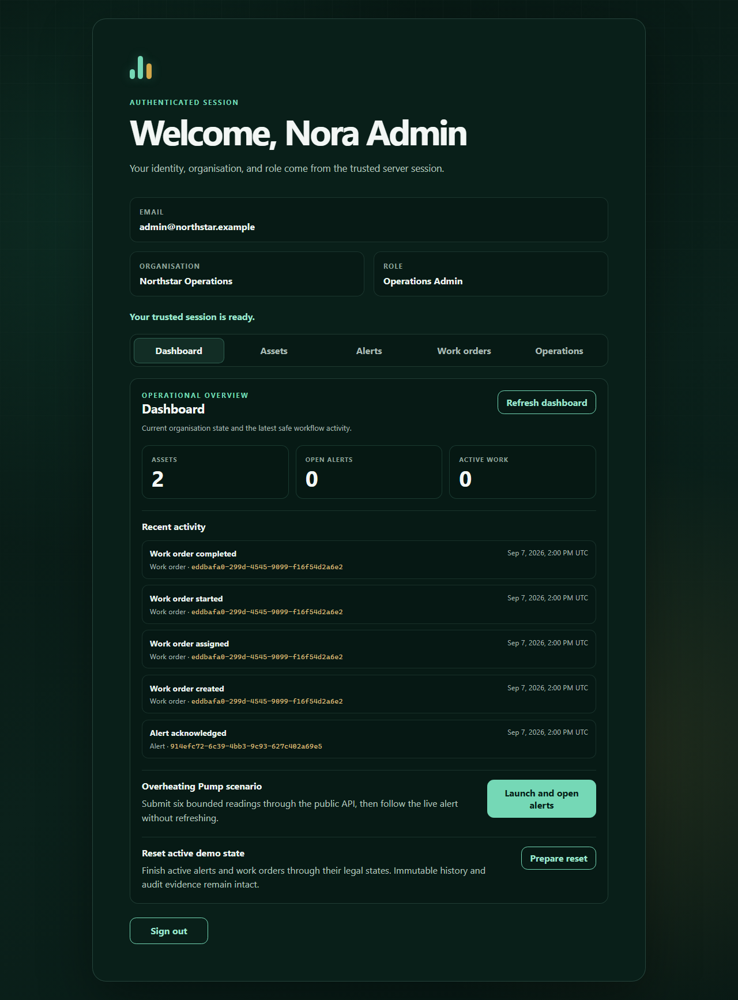

# Hosted demonstration evidence: September 2026

This is a small, sanitized evidence package for the public AssetPulse demo on
Render Free with PostgreSQL 17 on Neon Free, both in Frankfurt. The measurements
and screenshots below were captured on **7 September 2026**, against application
revision **`7541f32a25763aa8439173c0e14db542f6993bbb`**. They were prepared for public
review on 12 September; preparing this package did not rerun the scenarios.

The public origin is [the AssetPulse demo](https://assetpulse-rv4z.onrender.com).
It is a shared demonstration with synthetic data, so visible records change.
See the [operations runbook](../operations/RUNBOOK.md) for reproduction and
recovery procedures, and [performance instructions](../performance/README.md)
for the bounded k6 scenario.

## Revision status

The later source revision `1b0311ba7822471cf159f030b48d2ad5dac9db99` passed the
[verification workflow](https://github.com/moar0210/AssetPulse/actions/runs/34270179665),
confirmed through the GitHub API on 12 September 2026. That CI result is separate
from the historical hosted evidence below.

The [September 12 review-readiness record](review-readiness-1b0311b.json)
adds a fresh deployment identity check, nine passing public smoke checks,
byte-identical public OpenAPI, and all three passing desktop browser journeys
against `1b0311b`. One initial browser attempt received a `503` before the sign-in
screen loaded. After explicit status, document, and smoke readiness checks,
the unchanged journeys passed in 1.1 minutes. That failed attempt remains recorded;
the successful run does not claim uninterrupted availability.

The same application's fresh local checkout passed all 295 frontend tests,
formatting, lint, strict type checking and production build on Node 24. Contract,
smoke/performance helpers and simulator passed 48 checks. Local Docker Desktop
could not start; PostgreSQL and Compose verification is the linked exact-revision
CI evidence. These checks prepare final review; they do not complete v1.0 acceptance.

## Functional journey and screenshots

The September 7 public verifier passed its eight checks: status, HTTPS security
headers, session and CSRF behavior, seeded login and token rotation, protected
tenant reads, SSE readiness/reconnect, logout, and denial after logout. These
checks predate the later public OpenAPI verification.

All three desktop Chromium journeys passed: live incident to completed work,
organisation and role boundaries, and two-client optimistic conflict recovery.
The three mobile Chromium journeys also passed in a recorded 1.2-minute run,
using evidence-test revision `aaf8478c20b0db07ac0135fd10cf8d9b780cd7e4`. That
test correction selects the newest retained same-title work order and verifies
its exact identifier; it does not change the deployed runtime revision.

These are unmodified screenshots from the September 7 desktop run. Names and
example-domain emails are the application's synthetic seeded accounts.

| View                                                              | What is visible                                                                            |
| ----------------------------------------------------------------- | ------------------------------------------------------------------------------------------ |
| [Live alerts](screenshots/live-alerts-2026-09-07.png)             | A Viewer sees three occurrences and the connected live-update state.                       |
| [Assigned work](screenshots/assigned-work-2026-09-07.png)         | An Operations Admin sees the assigned technician and a visible keyboard focus ring.        |
| [Completed journey](screenshots/completed-journey-2026-09-07.png) | The dashboard shows completed work in recent activity, with no open alerts or active work. |

## Bounded performance measurement

[Raw k6 summary](k6-hosted-7541f32.json), generated at
`2026-09-07T14:21:46.608Z`, contains the original summary and all threshold
results. The already-active service ran k6 1.7.1 with one virtual user and exactly
three iterations, a 10-second request timeout, and a 30-second alert deadline.
Each iteration requires an exact three-occurrence increase and the submitted
latest timestamp, preventing success on an older alert.

| Observation               |       Result |
| ------------------------- | -----------: |
| Completed iterations      |          3/3 |
| Successful checks         |        31/31 |
| Failed HTTP requests      |         0/31 |
| Telemetry acceptance p95  |     225.8 ms |
| Telemetry-to-alert p95    |   2,969.1 ms |
| HTTP request duration p95 | 1,923.336 ms |
| Total scenario duration   |     13.333 s |

This is a journey timing check with a very small sample. It does not establish
throughput, concurrency capacity, an SLO, or typical latency for other days.
The percentile values are k6's reported values for this sample.

## Cold start and warm follow-up

The [timed status requests](cold-start-7541f32.json) followed a 17-minute probe
idle period. The first request began at `2026-09-07T19:44:26.2877122Z` and returned
HTTP 200 with exact status `available` after **115,508.151 ms**. Its immediate
warm follow-up returned the same result in **246.138 ms**.

The captured provider startup record for revision `7541f32` showed 16 validated
Flyway migrations, schema version 16 with no migration required, and Spring
startup taking 92.603 seconds. The status response itself contained no revision
field, so attribution uses that contemporaneous startup record. This is one
observed sleep/wake cycle. Status alone does not prove database readiness;
authenticated login and protected reads serve that purpose.

## Telemetry query plan

The [sanitized query plan](telemetry-range-plan-7541f32.txt) was captured at
`2026-09-07T14:24:23.4866416Z` using the repository's
[bounded read-only query](../operations/telemetry-range-explain.sql), a temporary
read-only login, certificate verification, and required channel binding. The
temporary login was removed after capture.

For the window `[2026-09-07T13:00:00Z, 2026-09-07T15:00:00Z)` and limit 100, the
plan returned 42 rows using
`ix_telemetry_reading_organisation_sensor_observed_id`. It reported an index-only
scan with **42 heap fetches**, a 26 kB quicksort, eight shared buffer hits at the
final node, 0.455 ms planning time, and 0.136 ms execution time. Organisation and
sensor literals are redacted; costs, cardinality, buffers, and timings are intact.

This small observed cardinality provides no evidence for another index. The
index-only node name does not mean the query avoided all heap access.

## Trace continuity and operational snapshot

The [correlation excerpt](telemetry-trace-7541f32.json) preserves one recorded
telemetry flow's acceptance and processing span relationship. Acceptance and
processing share trace `8c91e8c7aa3e99c479b58bea444633b6`. The processing span's
exported parent `b6ce4edb30da473e` equals the acceptance span ID. The same flow
covered processing start, three alert records, and completion. The excerpt is
a transcription of the captured relationship, not a raw trace export.

The [operational snapshot](operational-metrics-7541f32.json) at
`2026-09-07T19:25:38.543683799Z` records 424 HTTP requests, 18 error responses,
and zero pending, lagging, retrying, or dead telemetry processing values. The
exercise included expected authentication and permission denials; the aggregate
snapshot does not classify every error or establish an availability rate.

Reported HTTP average duration was 2,623.543 ms and the timer's reported maximum
was 14.232 ms. The reporter calculates average from total time/count and reads
maximum separately from the timer. These values have different retention
semantics and must not be presented as the mean and maximum of one fixed sample.
They are retained as observed, without correcting or normalizing the numbers.

## Rollback rehearsal

The [sanitized rollback record](rollback-rehearsal-7541f32.json) captures a
compatible deployment, rollback, and restoration on September 7. Rollback
completed in 113 seconds and restoration in 138 seconds. The eight-check public
verifier passed after both. All 16 migrations validated at schema version 16,
with no migration required.

Before rollback, after rollback, and after restoration, the recorded domain
markers agreed: three work orders, four alerts, 48 readings, and the selected
completed work order at version 3. The same selected and latest domain records
remained present. Automatic deployment was restored to run after CI checks pass.

This demonstrates retained database state across a compatible application
redeployment. It does not test reversing a migration, disaster recovery from a
database backup, or continued validity of process-local browser sessions.

## Evidence boundaries

- The raw k6 summary, cold-start requests, and operational snapshot are copied
  unchanged. The query plan redacts two seeded identifiers and trims heading padding; the rollback record
  removes provider deployment identifiers and adds its observation date.
- Screenshots show only the product and synthetic demo identities. This package
  excludes credentials, session material, database endpoints, provider resource
  identifiers, private workspace paths, and unrestricted browser/log exports.
- Recorded Render limits were 512 MB memory and a dashboard-reported 0.15 CPU.
  CPU/RAM history was unavailable on that Free plan. These are historical
  observations, not measured application resource consumption or current plan
  promises.
- The historical hosted runs do not verify a later deployed revision. Final
  review and any release acceptance must use the current source checks and
  separately recorded public verification.
